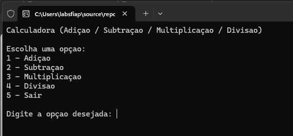
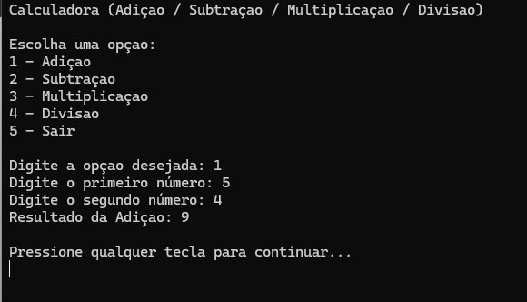
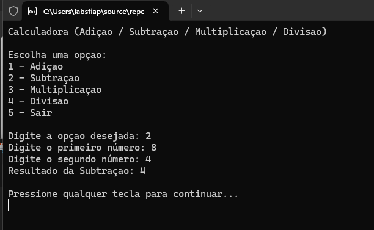
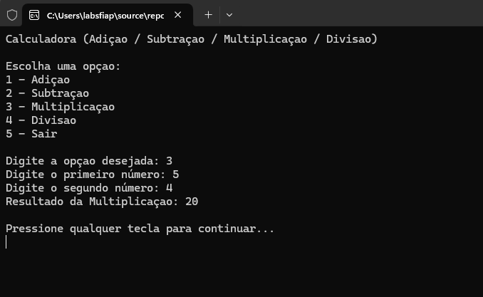
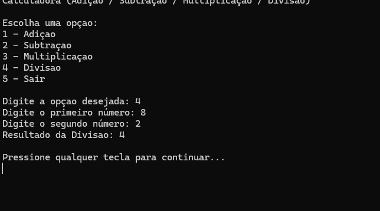

# Calculadora console - CP1

## Integrantes
- Ana Clara Melo
- David Murilo de Oliverira Soares
- Lucas Serrano 
- Yasmin Gonçalves Coelho

## Descrição
Aplicação console em C# que realiza operações matemáticas básicas:
- Adição
- Subtração
- Multiplicação
- Divisão

## Menu da Calculadora

## Evidências

### Adição

### Subtração

### Multiplicação

### Divisão

